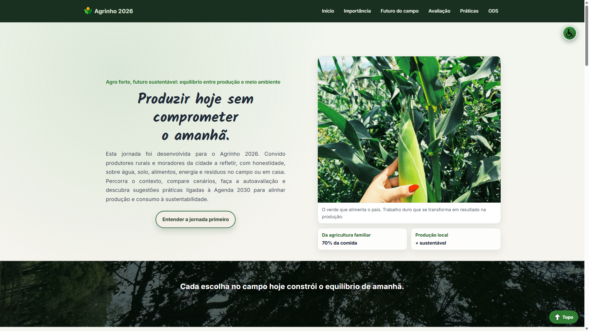

# Jornada Agro Forte · Agrinho 2026

> Trilha educativa sobre **Agro forte, futuro sustentável: equilíbrio entre produção e meio ambiente**. O site convida produtores rurais e moradores da cidade a refletir sobre água, solo, alimentos, energia e resíduos, com comparador de cenários, autoavaliação, gráfico, flash-cards de prioridades, sugestões práticas e Agenda 2030 ONU (Organização das Nações Unidas).

**Autora:** Milena Lopes Faustin · **Escola:** Instituto de Educação Prof. César Prieto Martinez · **Categoria:** Programação (Subcategoria 3)

## 📸 Capturas de tela



## 🛠️ Tecnologias

- HTML5
- CSS3 (variáveis em português, layout modular, responsivo)
- JavaScript (sem frameworks)
- JSON local (`jornada-dados.json` + `jornada-dados.js`)

## 🧰 Ferramentas usadas

- [Canva](https://www.canva.com/), ícones da interface e referências visuais (criação autoral)
- [Contrast Ratio](https://contrast-ratio.org/), teste das cores do alto contraste (amarelo, preto e branco)
- [Figma](https://www.figma.com/) e [Lovable](https://lovable.dev/), referências de layout adaptadas ao projeto
- [Alura](https://www.alura.com.br/), inspiração para gráfico, cronômetro e flash-cards
- [Piskel](https://www.piskelapp.com/) + [FreeConvert](https://www.freeconvert.com/pt/gif-to-ico), logo do projeto e conversão para favicon
- [remove.bg](https://www.remove.bg/pt-br), remoção de fundo em parte dos ícones
- [ResizePixel](https://www.resizepixel.com/pt/convert-image-to-black-white/), ícones ODS em preto e branco

**Tipografia:** **Inter** e **Kalam** (SIL Open Font License 1.1), carregadas via [Google Fonts](https://fonts.google.com/) em `src/assets/css/base/fontes.css`.

Créditos e licença: [`atribuicoes.html#fontes-tipografia`](atribuicoes.html#fontes-tipografia).

Fotografias, textos da jornada e demais créditos: [`atribuicoes.html`](atribuicoes.html).

## 📁 Estrutura (entrega)

```text
.
├── index.html
├── atribuicoes.html
├── img-projeto.png
├── README.md
├── LICENSE
└── src/assets/   (css, js, dados, imagens)
```

## 🌍 Demonstração/visualização online

- 🔗 [GitHub Pages](https://faustinmilena-design.github.io/Agricultura-Consciente-Agrinho-2026/)
- 🔗 [Vercel](https://agricultura-consciente-agrinho-2026-rho.vercel.app/)
- 📦 [Repositório](https://github.com/faustinmilena-design/Agricultura-Consciente-Agrinho-2026)
- 👤 [Perfil da autora](https://github.com/faustinmilena-design)

## ♿ Acessibilidade

Menu flutuante com ajuste de tamanho de fonte, alto contraste, modo escuro e reset e textos alternativos nas imagens.

## 📄 Licença

Código-fonte sob **licença MIT** (2026, Milena Lopes Faustin). Fotografias e ícones autorais: ver atribuições no site.
